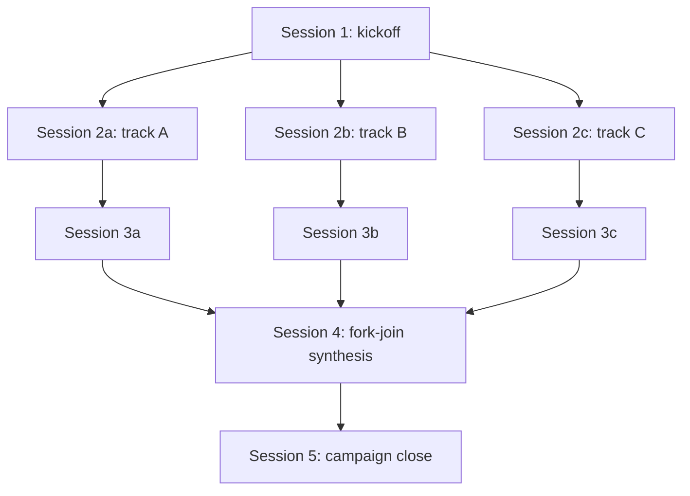

<!-- workflow-version: 1.0.0 -->
<!-- last-updated: 2026-04-26 -->

# Stage Flow Template

A **stage flow** is a DAG artifact that documents the execution graph of a multi-track or multi-stage campaign. Use a stage-flow document when the campaign's execution order is non-linear — typically:

- Multi-track campaigns where some sessions can run in parallel.
- Campaigns with fork-join points (e.g., 3 parallel investigation tracks → 1 synthesis session).
- Campaigns with conditional branches (e.g., stage X runs only if stage Y produces finding Z).
- Campaigns where session ordering or sub-numbering matters for handoff legibility.

For purely linear sprints (Session 1 → 2 → 3 → ...), a stage-flow document is unnecessary; the implicit linear order is documented in the sprint spec's session breakdown. Adopt a stage-flow document when the implicit order is ambiguous or non-trivial.

The stage-flow document supports **three formats**, with the same content. Choose the format that best fits the campaign's complexity and the consumers' tooling. Multiple formats can coexist in the same document if helpful.

## Format 1: ASCII

For simple DAGs (≤10 nodes, low branching), an ASCII representation is most readable in code-review and terminal contexts. Example:

```
Session 1 (kickoff)
    │
    ├─→ Session 2a (track A: parallel)
    │       │
    │       └─→ Session 3a
    │               │
    │               ▼
    ├─→ Session 2b (track B: parallel) ────┐
    │       │                              ▼
    │       └─→ Session 3b ──→ Session 4 (synthesis: fork-join)
    │                              │
    └─→ Session 2c (track C: parallel) ────┘
            │
            └─→ Session 3c ─────────────────┘
```

Conventions:
- Boxes around node names are optional; use plain text + indentation.
- Use `│`, `├`, `└`, `─`, `→`, `▼`, `◀`, etc. (Unicode box-drawing).
- Top-to-bottom is execution order; left-to-right is parallelism.
- Fork-join points show as multiple incoming edges to a single node.

## Format 2: Mermaid

For DAGs with 10–30 nodes or significant branching, Mermaid syntax renders cleanly in GitHub/GitLab/Markdown viewers and supports automated layout:



Conventions:
- Use `flowchart TD` (top-down) for execution-order graphs.
- Node IDs are short tokens (e.g., `S2a`); node labels include the human-readable session description.
- Edge labels are optional; use them for conditional branches or stage dependencies that need explanation.

## Format 3: Ordered List

For DAGs that are mostly linear with occasional parallel sections, or campaigns where the execution graph is best communicated as prose, an ordered list with explicit dependency annotations works well:

```markdown
1. **Session 1 (kickoff).** No prerequisites.
2. **Session 2a, 2b, 2c (parallel tracks A, B, C).** Prerequisites: Session 1.
   These three sessions run in parallel; no dependency between them.
3. **Session 3a.** Prerequisite: Session 2a.
4. **Session 3b.** Prerequisite: Session 2b.
5. **Session 3c.** Prerequisite: Session 2c.
6. **Session 4 (fork-join synthesis).** Prerequisites: Sessions 3a, 3b, 3c.
7. **Session 5 (campaign close).** Prerequisite: Session 4.
```

Conventions:
- Use the prerequisite annotation to make dependencies explicit even though the linear list order may suggest sequence.
- Note parallelism explicitly ("these run in parallel; no dependency").
- Number all sessions sequentially even if some are parallel; the number is just an identifier.

## Stage Sub-Numbering

When a campaign has multiple stages and sessions within each stage, use two-level numbering:

- **Stage 1:** Sessions 1.1, 1.2, 1.3 (might run in parallel within stage 1)
- **Stage 2:** Sessions 2.1, 2.2 (depend on stage 1 completion)
- **Stage 3:** Session 3.1 (depends on stage 2 completion)

Stages are coarse-grained dependency boundaries; sessions are fine-grained execution units. Stage transitions are natural campaign-coordination-surface checkpoints (per `protocols/campaign-orchestration.md` §5 Pre-Execution Gate).

## Template Use

When generating a stage-flow document for a specific campaign:

1. Pick the format that best fits the campaign's complexity and consumer tooling.
2. List all sessions with stable IDs (don't renumber sessions mid-campaign).
3. Document all dependencies (prerequisites, fork-join points, conditional branches).
4. Annotate any sessions that can run in parallel.
5. Cross-reference the sprint spec's session breakdown for full session details (this document is the EXECUTION GRAPH, not the per-session detail).
6. Place the stage-flow document in the campaign folder alongside other campaign artifacts (per `protocols/campaign-orchestration.md` §3 authoritative-record).

<!-- Origin: synthesis-2026-04-26 evolution-note-1 (audit-execution).
     ARGUS Sprint 31.9's audit campaign used a multi-stage fork-join
     structure (3 parallel investigation tracks → 1 synthesis session).
     The execution graph was tracked informally; this template
     formalizes the artifact. F7: 3 formats supported (ASCII, Mermaid,
     ordered-list) so consumers can choose based on tooling and
     complexity. -->
